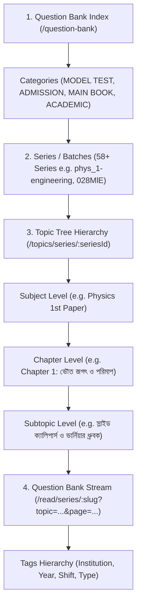

# Chorcha Question Bank (QB) API & Hierarchy Architecture

This document details the complete structure, endpoints, parameters, and algorithms required to scrape or import all Question Banks, Subjects, Chapters, Subtopics, and Questions with full tag and topic hierarchy from Chorcha.

---

## 1. High-Level Architecture Overview

Chorcha organizes questions into a 4-tier hierarchy:



---

## 2. API Endpoints Reference

All requests require the Bearer Token from `.env` (`CHORCHA_TOKEN`):

```http
Authorization: Bearer <CHORCHA_TOKEN>
User-Agent: Mozilla/5.0
```

### Endpoint 1: Master Question Bank Index

- **URL:** `GET https://api.chorcha.net/question-bank`
- **Purpose:** Returns all 58+ series, their category mappings, and display orders.
- **Key Fields:**
  - `data.series`: List of all active series (`_id`, `name`, `slug`, `logo`, `archive`, etc.).
  - `data.details`: Categorized into `MODEL TEST`, `ADMISSION`, `MAIN BOOK`, and `ACADEMIC`.
  - `data.order`: Category ordering in Bengali (`মডেল টেস্ট`, `প্রতিষ্ঠান ভিত্তিক`, `বিষয় ভিত্তিক`).

---

### Endpoint 2: Topic & Syllabus Hierarchy Tree

- **URL:** `GET https://api.chorcha.net/topics/series/{series_id}`
  _(e.g., `https://api.chorcha.net/topics/series/6UYZkI` or `tn9B4k`)_
- **Purpose:** Provides the complete hierarchical tree of Subjects, Chapters, and Topics (11,000+ nodes) with titles and question counts.
- **Key Fields:**
  - `data.data.nodes`: Object mapping each `topic_id` to its human-readable title:
    ```json
    {
      "phys_1_1": "ভৌত জগৎ ও পরিমাপ",
      "phys_1_2": "ভেক্টর",
      "SnZd7aSXQa": "স্লাইড ক্যালিপার্স ও ত্রুটি",
      "zZL906R1xE": "নূরলদীনের কথা মনে পড়ে যায়"
    }
    ```
  - `data.data.tree`: Nested parent-to-child map defining the entire graph.
  - `data.data.parent`: Child-to-parent inverse map for looking up the chapter/subject of any subtopic.
  - `data.data.sum`: Total number of questions available under each node.

---

### Endpoint 3: Paginated Question Fetcher

- **URL:** `GET https://api.chorcha.net/read/series/{series_slug}?topic={topic_id}&page={page}&filters={filters}&label_filter={label_filter}`
- **Query Parameters:**
  - `topic`: Root topic (`root`), Subject (`phys_1`), Chapter (`phys_1_1`), or Leaf Node (`SnZd7aSXQa`).
  - `page`: Page index starting from `1` (25 questions per page).
  - `filters`: Question type / state filter (`MCQ`, `WRITTEN`, `MCQ_5`, `marked`, `unmarked`).
  - `label_filter`: Filter by exam tag/label if applicable.
- **Question Structure:**
  ```json
  {
    "_id": "rWzg2qg47m3_zGGi",
    "question": "...",
    "A": "Option A text",
    "B": "Option B text",
    "C": "Option C text",
    "D": "Option D text",
    "answer": "B",
    "solution": "...",
    "type": "MCQ",
    "tags": "BUET 24-25, RUET 23-24 (2nd Shift)",
    "topic": "SnZd7aSXQa",
    "subject": "phys",
    "meta": { "locked": false }
  }
  ```

---

### Endpoint 4: User Practice Heatmap & Streaks

- **URL:** `GET https://api.chorcha.net/users/practice_map`
- **Purpose:** User study tracking, daily exam count heatmap (`exam_map`), streak counts, and activity logs.

### Endpoint 5: Live Exams & Paper Ingestion (`/read/:exam_id` & `/live-exam/:exam_id`)

- **Metadata URL:** `GET https://api.chorcha.net/live-exam/{exam_id}`
  - **Purpose:** Exam metadata (name, duration, negative markings, total questions, marks).
- **Encrypted Content URL:** `GET https://api.chorcha.net/read/{exam_id}`
  - **Purpose:** Returns the exam questions and answers along with the decryption key in the response header `x-chorcha-id`.
  - **Decryption:** Text diff using `(charCode(i) - key.charCodeAt(i % 16)) & 0xffff`.

---

## 3. Standard Series Naming Convention

Subject-based series in Chorcha follow the `{subject}_{paper}-{target}` format:

| Subject & Paper           | Target / Category | Series Slug          |
| :------------------------ | :---------------- | :------------------- |
| **Physics 1st Paper**     | Engineering       | `phys_1-engineering` |
| **Physics 1st Paper**     | Medical           | `phys_1-medical`     |
| **Physics 2nd Paper**     | Engineering       | `phys_2-engineering` |
| **Physics 2nd Paper**     | Medical           | `phys_2-medical`     |
| **Chemistry 1st Paper**   | Engineering       | `chem_1-engineering` |
| **Chemistry 1st Paper**   | Medical           | `chem_1-medical`     |
| **Chemistry 2nd Paper**   | Engineering       | `chem_2-engineering` |
| **Chemistry 2nd Paper**   | Medical           | `chem_2-medical`     |
| **Higher Math 1st Paper** | Engineering       | `math_1-engineering` |
| **Higher Math 2nd Paper** | Engineering       | `math_2-engineering` |
| **Biology 1st Paper**     | Medical           | `bio_1-medical`      |
| **Biology 2nd Paper**     | Medical           | `bio_2-medical`      |

---

## 4. Full Crawler / Scraper Implementation

Below is a complete Python script to fetch all subjects, map the topic tree, and download all questions with their hierarchy preserved:

```python
import urllib.request
import urllib.parse
import json
import os
import time

TOKEN = os.getenv("CHORCHA_TOKEN", "<YOUR_CHORCHA_TOKEN>")
HEADERS = {
    "Authorization": f"Bearer {TOKEN}",
    "User-Agent": "Mozilla/5.0"
}

def api_get(url):
    req = urllib.request.Request(url, headers=HEADERS)
    with urllib.request.urlopen(req) as resp:
        return json.loads(resp.read().decode("utf-8"))

def fetch_all_questions_for_series(series_id, series_slug):
    print(f"\n[+] Processing Series: {series_slug} (ID: {series_id})")

    # 1. Fetch Topic Hierarchy Tree
    topics_url = f"https://api.chorcha.net/topics/series/{series_id}"
    topic_res = api_get(topics_url)
    nodes_map = topic_res.get("data", {}).get("data", {}).get("nodes", {})
    parent_map = topic_res.get("data", {}).get("data", {}).get("parent", {})

    # 2. Iterate through Root/Subject/Chapter nodes
    page = 1
    all_questions = []

    while True:
        url = f"https://api.chorcha.net/read/series/{series_slug}?topic=root&page={page}&filters=&label_filter="
        try:
            res = api_get(url)
            questions = res.get("data", {}).get("questions", [])
            if not questions:
                break

            for q in questions:
                topic_id = q.get("topic")
                topic_name = nodes_map.get(topic_id, "Unknown Topic")
                parent_id = parent_map.get(topic_id)
                chapter_name = nodes_map.get(parent_id, "General Chapter")

                all_questions.append({
                    "id": q.get("_id"),
                    "question": q.get("question"),
                    "options": {
                        "A": q.get("A"),
                        "B": q.get("B"),
                        "C": q.get("C"),
                        "D": q.get("D")
                    },
                    "answer": q.get("answer"),
                    "type": q.get("type"),
                    "tags": q.get("tags"),
                    "subject": q.get("subject"),
                    "topic_id": topic_id,
                    "topic_name": topic_name,
                    "chapter_name": chapter_name
                })

            print(f"  Page {page} fetched: {len(questions)} items (Total: {len(all_questions)})")
            page += 1
            time.sleep(0.2)  # Rate limiting safety
        except Exception as e:
            print(f"  Error on page {page}: {e}")
            break

    return all_questions

if __name__ == "__main__":
    # Fetch all series from question bank
    qb_data = api_get("https://api.chorcha.net/question-bank")
    series_list = qb_data.get("data", {}).get("series", [])
    print(f"Total Series Found: {len(series_list)}")

    # Example: Scraping first series
    if series_list:
        first = series_list[0]
        questions = fetch_all_questions_for_series(first["_id"], first["slug"])
        print(f"\nFinished! Total questions collected: {len(questions)}")
```

---

---

## 6. Complete Ingestion & Database Sync Script (Bun / TypeScript / Drizzle)

Below is the complete, runnable end-to-end script used to:

1. Fetch all Exam IDs (from Chorcha Series / Live Exams).
2. Decrypt encrypted questions (`decodeChorcha` using `x-chorcha-id` header).
3. Insert questions, options (MCQ), parts (Written), topics, chapters (`qb_question_chapters`), exam sheets (`qb_exam_sheets`), and historical tags/sources (`qb_sources` & `qb_question_sources`).
4. Automatically recalculate all count aggregations (`recalculateAllCounts()`).

```typescript
import { db } from "./src/db";
import {
  qbExamSheets,
  qbExamSheetQuestions,
  qbQuestions,
  qbQuestionOptions,
  qbQuestionParts,
  qbQuestionChapters,
  qbSources,
  qbQuestionSources,
  qbChapterSources,
  qbTopics,
  qbChapters,
  qbSubjects,
  qbContainerItems,
} from "./src/db/schema";
import { v7 as uuidv7 } from "uuid";
import { eq, inArray } from "drizzle-orm";
import { recalculateAllCounts } from "./src/services/qb-count.service";

const token = process.env.CHORCHA_TOKEN;

// 1. Decryption Helper
function decodeChorcha(
  text: string | null | undefined,
  key: string | null,
): string {
  if (!text || !key) return text || "";
  let chars = [];
  for (let i = 0; i < text.length; i++) {
    const diff = (text.charCodeAt(i) - key.charCodeAt(i % 16)) & 0xffff;
    chars.push(String.fromCharCode(diff));
  }
  return chars.join("").replace(/\0/g, "");
}

function slugify(text: string): string {
  return text
    .toLowerCase()
    .trim()
    .replace(/[^a-z0-9]+/g, "-")
    .replace(/^-+|-+$/g, "");
}

// 2. All 33 DU A Unit (2000 - 2026) Exam IDs discovered from Chorcha Series "l1MPZkbM3_"
const DU_EXAM_IDS = [
  "HKtUZhw2DU1cm3xV",
  "ud-lRyghJ3JjWWWK",
  "OhNMTdGxGSrAHwDe",
  "i3UoCkvRo_mv1Brs",
  "tPOm--eNfZnYOHQ_",
  "Wrs7OpBnuCH8RbRV",
  "QodaTA55h2tDOgaX",
  "bAFddVQA2d5jooXx",
  "aVjZbCPobLgct-Y_",
  "YSR_lqat2DbwU3tN",
  "qNteVZrDuRoEje0h",
  "qeexj6e6KBH566-Y",
  "cciDdnTLDMdl3E-c",
  "OGv1ICodksuJQkRD",
  "BCJ0HROdhE3IlBDl",
  "BmjSLAXbgKQLKGFf",
  "tnkcBnJ9K16OKcyf",
  "YuAYYg3hcxKbHbyZ",
  "-L1UxLZvYXTgVKcn",
  "7E1v1phnqGOuMCaW",
  "EEe82Bp4sM7lMSSm",
  "Wtg8S07uuHBuX6FF",
  "-M2PY6YfobYisBuu",
  "q0EajUPAaVutjKiB",
  "ncwvOg5xGQv6ic45",
  "Ta6O_KuIw1ai8Htf",
  "qvdYGtAkHCG0qEc0",
  "xB-cGyZ5a3v_7Jim",
  "be-L9K1h_IpNgCpI",
  "nAsOfOFjTPzGQQvM",
  "-VrSylPXY1voyKar",
  "32tGXG_P4umDDG3x",
  "aw4swzK3FiH4ofVa",
];

async function ingestDUAQuestionBank() {
  console.log("=== Starting DU A Unit Question Bank Complete Ingestion ===");

  const [containerItem] = await db
    .select()
    .from(qbContainerItems)
    .where(eq(qbContainerItems.slug, "du-ka-science"));

  if (!containerItem) {
    throw new Error("Container item du-ka-science not found");
  }

  const allTopics = await db.select().from(qbTopics);
  const allChapters = await db.select().from(qbChapters);
  let allSources = await db.select().from(qbSources);

  const topicSlugMap = new Map(allTopics.map((t) => [t.slug, t]));
  const topicIdMap = new Map(allTopics.map((t) => [t.id, t]));
  const chapterIdMap = new Map(allChapters.map((c) => [c.id, c]));
  const sourceSlugMap = new Map(allSources.map((s) => [s.slug, s]));

  function getChapterIdForTopic(topicId: string) {
    let curr = topicIdMap.get(topicId);
    while (curr) {
      if (curr.parentId) {
        if (chapterIdMap.has(curr.parentId)) {
          return curr.parentId;
        }
        curr = topicIdMap.get(curr.parentId);
      } else {
        break;
      }
    }
    return null;
  }

  const existingExamSheets = await db
    .select()
    .from(qbExamSheets)
    .where(eq(qbExamSheets.containerItemId, containerItem.id));

  const existingSlugMap = new Map(
    existingExamSheets.map((es) => [es.slug, es]),
  );

  for (let idx = 0; idx < DU_EXAM_IDS.length; idx++) {
    const examId = DU_EXAM_IDS[idx];
    console.log(
      `\n[${idx + 1}/${DU_EXAM_IDS.length}] Processing Chorcha Live Exam ID: ${examId}...`,
    );

    try {
      const res = await fetch(`https://api.chorcha.net/read/${examId}`, {
        headers: {
          Authorization: `Bearer ${token}`,
          Accept: "application/json",
        },
      });

      const key = res.headers.get("x-chorcha-id");
      const json = await res.json();
      const liveInfo = json.data?.live;
      const qList = json.data?.questions || [];

      if (!liveInfo || qList.length === 0) {
        console.log(`Skipping ${examId} (No questions or invalid payload)`);
        continue;
      }

      const examTitle = liveInfo.name || `DU Exam ${examId}`;
      const examSlug = slugify(examTitle);
      const isWritten =
        examTitle.toLowerCase().includes("written") ||
        qList[0]?.type?.includes("CQ") ||
        qList[0]?.type?.includes("WRITTEN");
      const examType = isWritten ? "written" : "mcq";
      const duration = liveInfo.duration || 45;
      const negMark = liveInfo.negativeMarking === "true" ? "0.25" : "0";

      let examSheet = existingSlugMap.get(examSlug);
      if (examSheet) {
        console.log(
          `Exam sheet "${examTitle}" already exists (${examSheet.id}). Skipping re-insert.`,
        );
        continue;
      }

      const newEsId = uuidv7();
      [examSheet] = await db
        .insert(qbExamSheets)
        .values({
          id: newEsId,
          containerItemId: containerItem.id,
          title: examTitle,
          slug: examSlug,
          examType: examType,
          durationMinutes: duration,
          totalMarks: String(qList.length),
          negativeMarks: negMark,
          orderIndex: idx + 1,
          questionCount: qList.length,
        })
        .returning();

      existingSlugMap.set(examSlug, examSheet);
      console.log(
        `Created Exam Sheet: "${examTitle}" (${examSlug}) with ${qList.length} questions`,
      );

      for (let qIdx = 0; qIdx < qList.length; qIdx++) {
        const q = qList[qIdx];
        const qId = uuidv7();
        const chorchaTopicSlug = q.topic;
        const dbTopic = chorchaTopicSlug
          ? topicSlugMap.get(chorchaTopicSlug)
          : null;
        const qText = decodeChorcha(q.question, key);
        const qSol = q.solution ? decodeChorcha(q.solution, key) : null;
        const ansKey = q.answer ? q.answer.trim() : "";
        const qType =
          q.type?.includes("CQ") || q.type?.includes("WRITTEN")
            ? "written"
            : "mcq";

        await db.insert(qbQuestions).values({
          id: qId,
          topicId: dbTopic?.id ?? null,
          qType: qType,
          questionText: qText,
          explanation: qSol,
          orderIndex: qIdx + 1,
          status: "published",
        });

        // Insert Options for MCQ
        if (qType === "mcq") {
          const optTexts = [
            { key: "A", text: decodeChorcha(q.A, key), orderIndex: 1 },
            { key: "B", text: decodeChorcha(q.B, key), orderIndex: 2 },
            { key: "C", text: decodeChorcha(q.C, key), orderIndex: 3 },
            { key: "D", text: decodeChorcha(q.D, key), orderIndex: 4 },
          ].filter((o) => o.text && o.text.trim().length > 0);

          for (const opt of optTexts) {
            await db.insert(qbQuestionOptions).values({
              id: uuidv7(),
              questionId: qId,
              optionText: opt.text,
              isCorrect: opt.key === ansKey,
              orderIndex: opt.orderIndex,
            });
          }
        } else {
          // Insert Parts for Written
          const parts = [
            { text: decodeChorcha(q.A, key), marks: "1", orderIndex: 1 },
            { text: decodeChorcha(q.B, key), marks: "2", orderIndex: 2 },
            { text: decodeChorcha(q.C, key), marks: "3", orderIndex: 3 },
            { text: decodeChorcha(q.D, key), marks: "4", orderIndex: 4 },
          ].filter((p) => p.text && p.text.trim().length > 0);

          for (const p of parts) {
            await db.insert(qbQuestionParts).values({
              id: uuidv7(),
              questionId: qId,
              partText: p.text,
              marks: p.marks,
              orderIndex: p.orderIndex,
            });
          }
        }

        // Link Chapter
        let chId = null;
        if (dbTopic?.id) {
          chId = getChapterIdForTopic(dbTopic.id);
          if (chId) {
            await db
              .insert(qbQuestionChapters)
              .values({
                questionId: qId,
                chapterId: chId,
              })
              .onConflictDoNothing();
          }
        }

        // Link Exam Sheet
        await db.insert(qbExamSheetQuestions).values({
          examSheetId: examSheet.id,
          questionId: qId,
          questionNumber: qIdx + 1,
        });

        // Link Sources / Tags (e.g., "DU A 25-26", "DU 2024")
        const rawTags: string[] = [];
        if (q.tags) {
          if (typeof q.tags === "string")
            rawTags.push(...q.tags.split(",").map((s) => s.trim()));
          else if (Array.isArray(q.tags))
            rawTags.push(...q.tags.map((s) => String(s).trim()));
        }
        if (q.tag) rawTags.push(String(q.tag).trim());

        const cleanTags = Array.from(
          new Set(rawTags.filter((t) => t && t.length > 0)),
        );
        for (const tagStr of cleanTags) {
          const tagSlug = slugify(tagStr);
          let source = sourceSlugMap.get(tagSlug);
          if (!source) {
            [source] = await db
              .insert(qbSources)
              .values({
                id: uuidv7(),
                sourceGroup: "admission",
                type: "university",
                name: tagStr,
                slug: tagSlug,
                institution: "University of Dhaka",
                unit: "KA / A Unit",
                year: parseInt(tagStr.match(/\d{2,4}/)?.[0] || "2024", 10),
                questionCount: 0,
              })
              .returning();
            sourceSlugMap.set(tagSlug, source);
          }

          await db
            .insert(qbQuestionSources)
            .values({
              questionId: qId,
              sourceId: source.id,
            })
            .onConflictDoNothing();

          if (chId) {
            await db
              .insert(qbChapterSources)
              .values({
                chapterId: chId,
                sourceId: source.id,
              })
              .onConflictDoNothing();
          }
        }
      }
      console.log(`Successfully ingested all questions for "${examTitle}"!`);
    } catch (err) {
      console.error(`Error processing exam ${examId}:`, err);
    }
  }

  console.log("\n--- Ingestion loop complete. Recalculating counts... ---");
  await recalculateAllCounts();
  console.log("All Question Bank exams ingested successfully!");
}

ingestDUAQuestionBank()
  .then(() => process.exit(0))
  .catch((e) => {
    console.error(e);
    process.exit(1);
  });
```

---

## 7. Conclusion & Verification

- **Can we get all questions across all subjects?** **Yes.** All 58+ question bank series and academic subjects are accessible via standard slugs and the master index.
- **Is topic & chapter hierarchy available?** **Yes.** The `/topics/series/:seriesId` endpoint contains over 11,000 human-readable node names and full tree relationships.
- **Are tags (University, Year, Shift, MCQ/Written) structured?** **Yes.** Each question contains a `tags` string and `type` property (`MCQ`, `MCQ_5`, `WRITTEN`) for classification.
