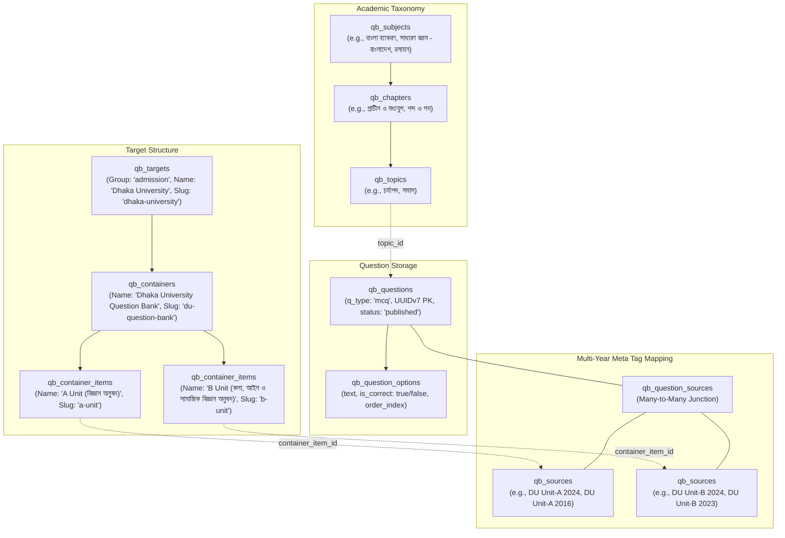

# 📖 Complete Question Bank Archive Import Documentation

This document provides complete end-to-end technical documentation of how past admission test archives from StudyClubBD are scraped, structured, and imported into the PostgreSQL 3NF database.

---

## 1. Architectural Mapping & Hierarchy Resolution

The platform’s data is structured to map into our 3NF database schema:



---

## 2. Reverse-Engineered Internal API Endpoints

### 2.1 Hierarchy Tree Discovery Endpoint
- **Endpoint:** `GET https://studyclubd.com/qb-archive/includes/ajax.php`
- **Query Parameters Used:**
  - `step=year&family=University&university=UNI_J32I8G&unit={UNIT_CODE}`:
    - DU A Unit: `unit=UNI_6321c505` (22 subjects)
    - DU B Unit: `unit=UNI_f20da169` (22 subjects)
  - `step=chapters&university=UNI_J32I8G&unit={UNIT_CODE}&subject={SUB_CODE}`:
    - Discovers all chapters for each subject.
  - `step=topics&university=UNI_J32I8G&unit={UNIT_CODE}&subject={SUB_CODE}&chapter={CHAP_CODE}`:
    - DU A Unit: 703 topic queues.
    - DU B Unit: 773 topic queues.

### 2.2 Question Fetching API
- **Endpoint:** `GET https://studyclubd.com/view-question1/`
- **Query Parameters Used:**
  `?university=UNI_J32I8G&unit={UNIT_CODE}&subject=SUB_...&chapter=CHA_...&topic=TOP_...&spa_ajax=1&page={PAGE}`
- **Payload Format:**
  ```json
  {
    "html": "<div class='mcq-item' data-db-id='23773'>...</div>",
    "has_more": true,
    "current_page": 1,
    "total_pages": 3
  }
  ```

---

## 3. Step-by-Step Data Pipeline

### Step 1: Target, Container, and Container Item Initialization
- `qb_targets`: Dhaka University (`slug: 'dhaka-university'`, `group: 'admission'`)
- `qb_containers`: Dhaka University Question Bank (`slug: 'du-question-bank'`)
- `qb_container_items`:
  - A Unit: `A Unit (বিজ্ঞান অনুষদ)` (`slug: 'a-unit'`, `order_index: 1`)
  - B Unit: `B Unit (কলা, আইন ও সামাজিক বিজ্ঞান অনুষদ)` (`slug: 'b-unit'`, `order_index: 2`)

### Step 2: High-Speed Concurrent Discovery & Extraction
A pool of 10 concurrent workers traversed all topic queues:
1. Paginates `page=1, 2, ...` until `has_more === false`.
2. Loads HTML into Cheerio to extract:
   - Question text: Cleaned LaTeX/Bangla text.
   - MCQ options: Circles (`A`, `B`, `C`, `D`) and option texts.
   - Correct Answer Flag: Extracted from `data-is-correct="true"`.
   - Meta Tag Strings: e.g., `[DU : Unit-B : 2023][DU : Unit-B : 2022]`.

### Step 3: Meta Tag Normalization & Multi-Source Linking
- Deduplicates and normalizes tags into structured year and institution sources.
- Inserts/retrieves cached `qb_sources` linked to the specific `container_item_id`.
- Connects `qb_questions` to `qb_sources` via `qb_question_sources` junction.

### Step 4: Count Recalculation
Runs `recalculateAllCounts()` to synchronize:
- Topics (`qb_topics.question_count`)
- Chapters (`qb_chapters.question_count`)
- Subjects (`qb_subjects.question_count`, `chapter_count`)
- Sources (`qb_sources.question_count`)
- Container Items (`qb_container_items.question_count`)
- Containers (`qb_containers.question_count`, `item_count`)
- Targets (`qb_targets.question_count`)

---

## 4. Current Import Statistics

| Entity / Metric | DU A Unit (`a-unit`) | DU B Unit (`b-unit`) | Total (DU Question Bank) |
|---|---|---|---|
| **Source URL** | `unit=UNI_6321c505` | `unit=UNI_f20da169` | `university=UNI_J32I8G` |
| **Questions Saved** | 4,278 | 1,643 | **5,921** |
| **Subjects Discovered** | 21 | 22 | **43** (unique across units) |
| **Exam Sources / Batches** | 32 (1995–2024) | 30 (1995–2024) | **62** |
| **Import Script** | `apps/server/scripts/import-du-a-unit.ts` | `apps/server/scripts/import-du-b-unit.ts` | — |

---

## 5. Client Route Integration

- **DU A Unit Practice:** `https://79.143.185.101:3003/qb/dhaka-university/du-question-bank/a-unit`
- **DU B Unit Practice:** `https://79.143.185.101:3003/qb/dhaka-university/du-question-bank/b-unit`
- Both units support:
  - Subject $\to$ Chapter $\to$ Topic dynamic drill-down filtering
  - Exam Year / Source filtering
  - Question Type (MCQ) filtering
  - 100 questions per page pagination
